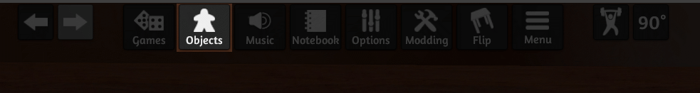
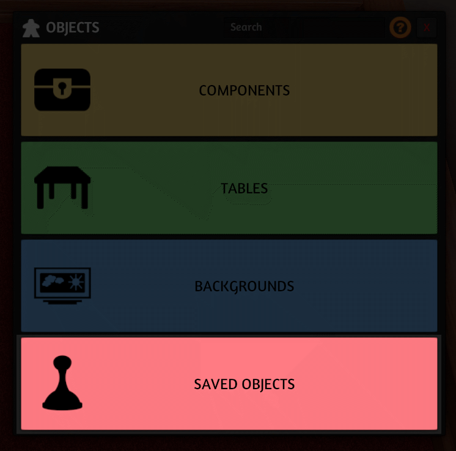
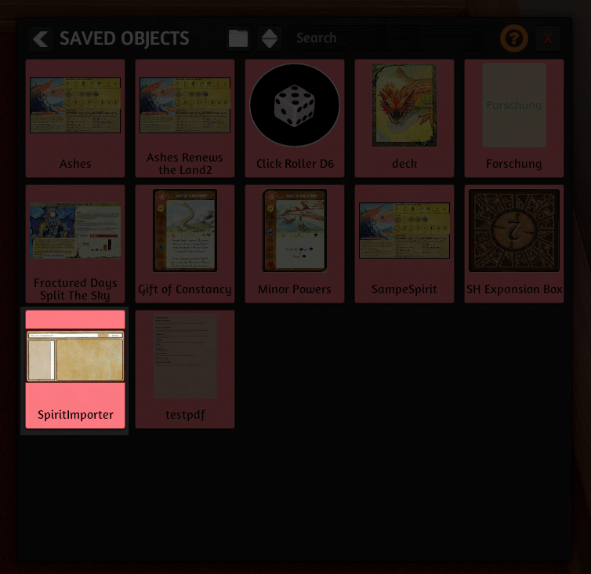

# Spirit Island Custom Spirits

This repo contains custom spirits for Spirit Island. They were created with [Spirit Island Renderer](https://github.com/LokiMidgard/spirit-island-renderer).

The spirits contained in this repository are compatible with Tabletop Simulator. You find them in the [deploy branch](https://github.com/LokiMidgard/spirit-island-custom-spirits/tree/deploy). The easiest way to load them in Tabletop Simulator is to use the included **Spirit Importer**.
Download both [SpiritImporter.json](https://raw.githubusercontent.com/LokiMidgard/spirit-island-custom-spirits/deploy/SpiritImporter.json) and [SpiritImporter.png](https://raw.githubusercontent.com/LokiMidgard/spirit-island-custom-spirits/deploy/SpiritImporter.png) and save them in your saved object folder of Tabletop simulator. Normally found in `%USERPROFILE%\Documents\My Games\Tabletop Simulator\Saves\Saved Objects`. After that you find it in the [**Saved Objects**](#saved-objects) menu in the game.

The Object allows you to choose which spirits from this repository you want to load. It will then load the most recent version of the spirit.

You find the used [lua script](https://github.com/LokiMidgard/spirit-island-renderer/blob/development/resources/spirit-importer/script.lua) in the [Spirit Island Renderer repository](https://github.com/LokiMidgard/spirit-island-renderer).

## Saved Objects

1. Open the Object menu in the toolbar
   
1. Open then the Saved Objects menu
   
1. Now select the Spirit Importer
   